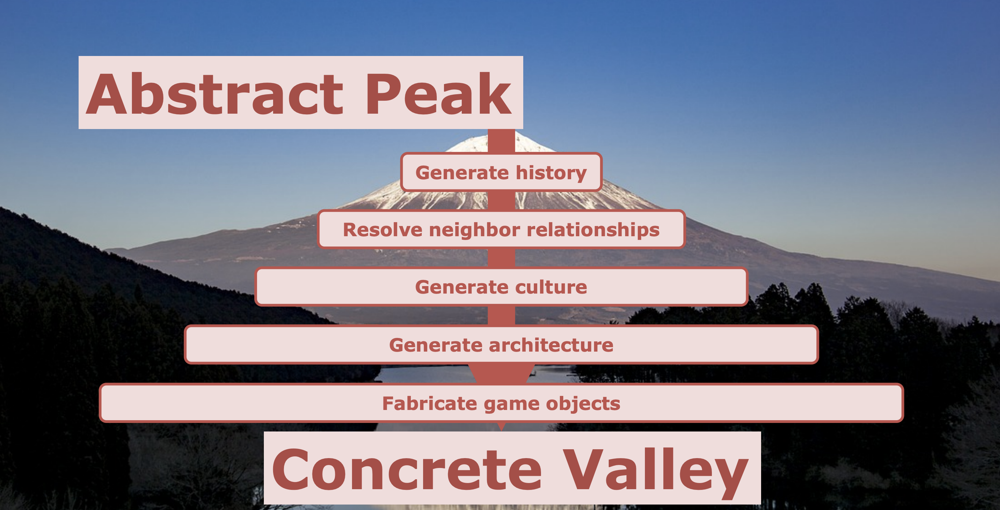
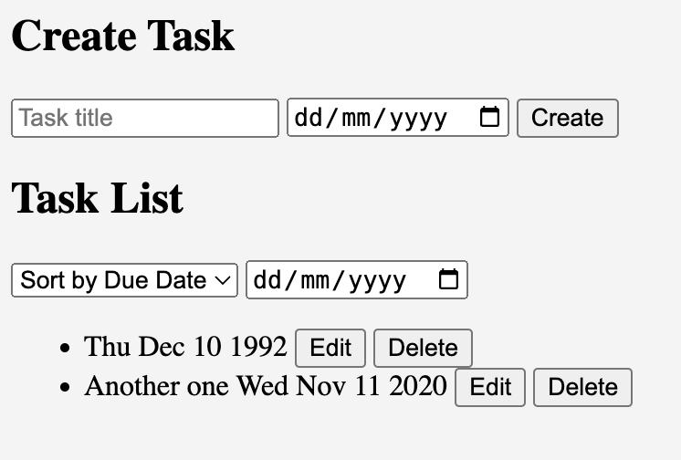

# Generative UI Playbook 

Authors: Gordon Brander, Ben Follington

A collection of theories, patterns, tricks, and intuitions about generative UI. Begins with high-level theory, and works its way down to pragmatic notes on practice.

# The theory of generative systems

## Emergence

Generative UI should be capable of emergence. Emergence is when a system’s behavior is more than the sum of its parts. 

Emergent systems exhibit:

- Change: emergent systems are constantly in flux. These changes are often nonlinear, and can be difficult to predict.
- Patterns: generative systems aren’t just random. General structures arise and repeat.
- Rules: underneath emergence is a system of rules, or a grammar.

Examples of emergence:

- Complex coordination emerging from ants laying down pheromone trails
- Price signals emerging from market trades
- Consciousness emerging from networks of neurons

Required ingredients for emergence:

- Mechanisms (building blocks, modules, subassemblies), that up the “stuff” of the system
- Rules (or interfaces), defining how mechanisms are combined
- Feedback, where the next step is the recursive function of new information plus the sum of all previous steps.

In some some sense, emergence is just the product of these ingredients. There are no extra “hidden” variables. Yet, unlike most systems, the whole is *not* reducible to the sum of the parts. That’s because emergent systems have a “state”, or “memory” that builds up via feedback within their environment. The particular history of the system is the irreducible “magic” ingredient that generates emergent behavior.

> Emergence is above all a product of coupled, context-dependent interactions. Technically these interactions, and the resulting system, are nonlinear. (John H. Holland, 1998, Emergence)

When observing an emergent system, watch for these important features:

- Feedback: Produces nonlinear behavior and acts as “memory”.
- Mechanisms: Specific interactions that produce effects.
- Agents: Independent parts of the system where the level of internal cooperation exceeds the level of external cooperation.
- Hierarchy: arises as a byproduct of recursive combination.
- Tipping points: Thresholds where the system shifts from one kind of behavior to another.
- [Keystone species](https://en.wikipedia.org/wiki/Keystone_species): Parts of a mature ecosystem that become load-bearing lynchpins.
- Decentralization: Centralized coordination acts as a severe constraint on emergence. Decentralized systems can try more things in parallel. 

More reading:

- [Emergence](https://www.amazon.com/Emergence-Chaos-Order-Helix-Books/dp/0738201421), John H. Holland, 1998
- [Thinking in Systems](https://www.amazon.com/Thinking-Systems-Donella-H-Meadows/dp/1603580557), Donella Meadows, 2008
- [Complexity, a guided tour](https://www.amazon.com/Complexity-Guided-Tour-Melanie-Mitchell/dp/0199798109), Melanie Mitchell, 2011
- [More is Different](https://www.tkm.kit.edu/downloads/TKM1_2011_more_is_different_PWA.pdf), Philip Anderson, 1972
- [50 Years of More is Different](https://www.nature.com/articles/s42254-022-00483-x), Steven Strogatz, Sara Walker, et al, 2022

## Evolution 

Evolution emerges in any system with:

- Mutation
- Memory
- Selection

You can look at many different systems through this lens, including social networks and multiplayer software. It’s not an ecosystem if it doesn’t evolve.

Questions:

- What parts of the system are mutating, changing?
- Where is memory stored? How? Feedback? Culture? In writing? Somewhere else?
- What selection pressures are present? What do they select for? Which should be present?

## Composability and compositionality

Emergence arises from mechanisms combined according to some rules. We call this *composition*, or in mathematics, *compositionality*. 

> Compositionality is the principle that a system should be designed by composing together smaller subsystems, and reasoning about the system should be done recursively on its structure. (Jules Hedges, [On Compositionality](https://julesh.com/2017/04/22/on-compositionality/))

Other related concepts are modularity and reductionism. However compositionality takes things a step further. It is a formal mathematical property, requiring composition *without side-effects*.

> More generally, I claim that the opposite of compositionality is emergent effects. The common definition of emergence is a system being “more than the sum of its parts”, and so it is easy to see that such a system cannot be understood only in terms of its parts, i.e. it is not compositional. Moreover I claim that non-compositionality is a barrier to scientific understanding, because it breaks the reductionist methodology of always dividing a system into smaller components and translating explanations into lower levels. (Jules Hedges, [On Compositionality](https://julesh.com/2017/04/22/on-compositionality/))

We said earlier that we *want* emergence, so what gives? Well, emergence is difficult to reason about using our limited symbolic cognition.

Compositionality can be a useful property for parts of a system that require *proofs* of particular properties. Compositionality is easily treatable through mathematics precisely *because* it excludes the messy nonlinear effects of emergence.

> Here we see that emergence in rule-governed systems comes close to being the obverse of reduction. (John H. Holland, 1998, Emergence)

How do you get compositionality? Avoid state, avoid mutation, compose pure functions.

Know where in the system you want emergence, and where in the system you want compositionality.

More reading:

- [On Compositionality](https://julesh.com/2017/04/22/on-compositionality/), Jules Hedges, 2017
- [Compositional components, emergent protocols](https://subconscious.substack.com/p/compositionality), Gordon Brander

## Multiple levels of composition

The most expressive generative systems compose at multiple levels.

- Letters combine into words, which describe ideas.
- DNA basepairs combine into genes, which encode traits.
- Minecraft lets you craft new blocks with new properties from combinations of other blocks.

When components of an alphabet are combined, they often express meanings which are different in kind to the alphabet that makes them up. Each new level of meaning forms another alphabet, at another level.

Each level has path-dependencies on the levels beneath. Lower levels constrain higher ones.

> At each level of observation the persistent combinations of the previous level constrain what emerges at the next level. (John H. Holland, 1998, Emergence)

The most powerful generative systems enable composition at multiple levels. This allows for great expressive power across different kinds of meanings, at multiple levels of complexity.

## Combinatorial space

Combinatorial space maps the possible states of a system as a landscape. This way of seeing can be applied to many systems. Evolutionary biologists think of the possibility space of traits as a [fitness landscape](https://en.wikipedia.org/wiki/Fitness_landscape), or the possibility space of phenotypes as a [morphospace](https://www.cambridge.org/core/books/abs/geometry-of-evolution/concept-of-the-theoretical-morphospace/3361BD3C95773CC970DCA25F01C0C7D8). AI researchers can think of the loss function of an algorithm as a [loss landscape](https://losslandscape.com/).

You will run into three kinds of combinatorial spaces:

- Simple landscape: picture a landscape with a single hill. Optimization problems are simple landscapes.
- Rugged landscape: imagine a mountain range with many peaks and valleys, many right and wrong answers. Optimization doesn’t work here. Hill climbing will get you stuck on the nearest peak (local maxima), thinking it is the highest peak. Tradeoffs dominate. A bit of adventurous random wandering is beneficial.
- Dancing landscape: imagine the roiling waves of a stormy ocean. You can summit a peak, but the peaks don’t stand still. If you want to survive, you’ll have to keep moving.

When building ecosystems, we’re trying to create a dancing landscape. 

More reading:

- [Possibility space](https://subconscious.substack.com/p/possibility-space)
- https://complexity.risd.edu/methods-insights/dancing-landscapes/

## Open-endedness

Open-endedness is a special condition that arises in some emergent systems. Many systems will settle toward a single state, or cycle through just a handful of states.

We want a general-purpose generative UI system to be open-ended, because open-endedness is where innovation comes from. The innovation comes from the system surprising itself.

It turns out that continually generating innovation is difficult to do. AIs and evolutionary algorithms tend to converge and get stuck. Yet, we know that some systems do seem to continually innovate: people continue to invent new things, markets continue to disrupt incumbents, life keeps evolving new species.

So how do we create generative systems capable of continual innovation? That’s an ongoing area of research in AI and evolutionary computing, called “[open-endedness](https://www.oreilly.com/radar/open-endedness-the-last-grand-challenge-youve-never-heard-of/)”. We don’t have answers yet, just heuristics.

A basic requirement for open-endedness is **unlimited composition**. For example, DNA has just four basepairs, but no limits on the length of the chain. If the chain were limited to 8, 10, 200 basepairs, the combinatorial space of DNA would be constrained. The lack of a limit on length acts as an enabler for open-endedness.

One way to get open-endedness is to cheat and import it:

- People are open-ended.
- Turing-complete scripting is open-ended.

What prevents open-endedness?

- Fixed categories: imposing top-down categorization ends open-endedness before it has a chance to start. The categorization creates a fixed possibility space. DOA. Consider how the App Store app categories are fixed. What if you create an innovation that doesn’t fit into these categories? It’s banned, by definition.
- Fixed filters: culling possibilities according to a fixed set of rules has the same effect as fixed categories. It causes convergence. The rules must evolve with the game.
- Fixed roles: in nature, hierarchy and specialization arise from the bottom-up, not from the top-down. These ecosystems role are contextual and constantly changing. 
- Fixed fitness functions: by definition, these create fixed possibility landscapes. In [Signals and Boundaries](https://mitpress.mit.edu/9780262525930/signals-and-boundaries/), John H. Holland points out that a truly open-ended fitness function would have to take in the whole world-state as its input. In other words, fitness in nature is defined by coevolution between species. It’s constantly changing and being changed as everything else changes.

More reading:

- [Open-endedness: The last grand challenge you’ve never heard of](https://www.oreilly.com/radar/open-endedness-the-last-grand-challenge-youve-never-heard-of/), Kenneth O. Stanley, Joel Lehman and Lisa Soros
- [Stepping stones in possibility space](https://subconscious.substack.com/p/stepping-stones-in-possibility-space)
- [Why Greatness Cannot Be Planned](https://www.amazon.com/Why-Greatness-Cannot-Planned-Objective/dp/3319155237), Kenneth O. Stanley, Joel Lehman, 2015

## Requisite variety

*[Variety](https://en.wikipedia.org/wiki/Variety_(cybernetics))* is a measure of how many different states a system can produce... literally by just counting them.

The Law of Requisite Variety says “who has the most variety drives the plot”.

> Ashby’s Law of Requisite Variety: The variety of a regulator must be at least as large as that of the system it regulates.

When observing an ecosystem, ask:

- Who has the most variety?
- How is the variety generated?
- Variety is limited by inputs. Where are the inputs? What limits them?

# Generative systems in practice

## Find the building blocks

Generative systems are made of mechanisms, or building blocks, or modules.

Your goal in designing a generative system is to find a set of mechanisms that can be combined to generate desired behaviors, as well as other interesting behaviors beyond those you can ask for and imagine.

Getting there requires a lot of play, and an eye for recognizing where you can draw a line around a building block, and which building blocks are open-ended.

## Design universal interfaces

Consider the lego dot. It’s a simple interface. Every lego, no matter the shape exposes this same interface. That means every lego can be combined with every other lego. The combinatorial space of a lego pair is the exponent of every lego brick. The more universal the API, the broader the combinatorial space, the more kinds of unexpected combinations can occur.

So, create universal interfaces. For example, don’t just create a verb, create a *verb that can act on many objects*.

> Verbs that can act on many objects. This is possibly the single most powerful thing you can do to make an interesting game. If you give a player a gun that can only shoot bad guys, you have a very simple game. But if that same gun can be used to shoot a lock off a door, break a window, hunt for food, pop a car tire, or write a message on the wall, now you start to enter a world of many possibilities. ([The Art of Game Design](https://schellgames.com/art-of-game-design), by Jesse Schell)

More reading:

- [Verbs that can act on many objects](https://gordonbrander.com/pattern/verbs-that-can-act-on-many-objects/)

## Carefully select ingredients + rules + randomness

A good generating system is often just carefully selected ingredients, rules, and randomness.

The quality of the meal depends upon the quality of the ingredients. Garbage in, garbage out. Take a look at a successful generative system and you’ll see carefully crafted components:

- Every tarot card has a rich tapestry of symbols, laden with multiple meanings. These symbols interact in rich ways when you combine different cards and layouts.
- Each [Oblique Strategy](https://en.wikipedia.org/wiki/Oblique_Strategies) is calibrated to provoke maximum generative ambiguity.
- Lego colors and shapes are carefully chosen to work together and combine to make interesting structures.

Ingredients and rules provide guidance, randomness creates surprise.

## No wrong answers

Sometimes we can create generative systems where the possibility space contains mostly good, or only good solutions. This tends to work best with more constrained generators, and where you can carefully curate the ingredients and rules. 

Examples:

- There are no bad I-Ching hexagrams
- There are no incorrect Tarot card combinations
- Color palette generators can be designed to always produce useful combinations by constraining specific contrast ranges and relationships (complementary, triadic, etc)

You can often create generators that are very expressive, yet consistently deliver impressive results. They seem to seek toward good outcomes. Yet, it is still worth noting that there is a fundamental tradeoff between constraint and expressivity.

In practice we often want tools that ride this line between constraint and expressivity. Consider a pottery wheel. It constrains movement along one axis (vertical), but amplifies your agency to express ideas along another (horiztonal). Consider what axes of agency are meaningful in a given context.

It can sometimes be useful to start with a less expressive generative system that has only “good answers”, and progressively excavate mechanisms that enable more expressivity over time.

## Unix philosophy 

In software, we talk about the [Unix Philosophy](https://en.wikipedia.org/wiki/Unix_philosophy):

- Write programs that do one thing and do it well.
- Write programs to work together.
- Write programs to handle text streams, because that is a universal interface.

This set of intuitions will serve us well when designing generative systems.

- Create mechanisms that do one thing and do it well.
- Create mechanisms to work together
- Create mechanisms with universal interfaces

## You’re designing an alphabet

[An interface is a language](https://mkremins.github.io/blog/controls-as-language/) for communicating with computers. When you’re designing generative UI, you’re designing an alphabet.

What is an alphabet? [A kit of parts, plus rules for combining them](https://patterns.architexturez.net/doc/az-cf-173046).

Consider your generative system through the lens of language:

- What are the letters, words, sentences, paragraphs?
- What is the grammar by which these things are combined?
- What are the parts of speech (nouns, verbs, adverbs, adjectives...)?

More reading:

- [Systems Generating Systems](https://patterns.architexturez.net/doc/az-cf-173046), Christopher Alexander, 1968
- [Controls as Language](https://mkremins.github.io/blog/controls-as-language/), Max Kreminski, 2016
- [Alphabets of emergence](https://subconscious.substack.com/p/provoking-emergence-with-alphabets)
- [Alphabets](https://gordonbrander.com/pattern/alphabets/)

## Small alphabets

When designing alphabets for emergence, constrain the alphabet, but don't constrain what may be written with it.

- Constrain the alphabet. Keeping the alphabet small makes it easy to learn. It also forces you, the designer, to create a composable alphabet. With a smaller set of letters, expressiveness is achieved by designing rules that allow letters to be composed with each other in many different ways.
- ...But don't constrain what may be written with it. Alphabets that produce open-ended emergence — written language, chemistry, DNA — don't place a limit on the number of letters you may combine in sequence, or the meanings you may construct with those letters. Anything achievable within the rules of the alphabet is permissible. This generates an open-ended possibility space.

DNA has a tiny alphabet (ATCG), but no limit on the number of basepairs that may be chained together, and no constraint, outside of natural selection, on the phenotypes that may be generated. The web defines a set of technologies (HTML, CSS, JavaScript), and rules for combining them, and does not censor what may be created with those technologies. This permissionless system continues to generate surprising new business models.

Failure modes:

- Large alphabets with many different interfaces. These don’t create large combinatorial spaces, since composition is severely constrained.
- Censorship: this is a kind of post-filtering that limits downside, but also upside.

When we shape the possibility space by way of shaping the alphabet, we enable open-ended innovation. When we cull generated results via fixed rules, we cause the system to converge.

More reading:

- [Small alphabets](https://gordonbrander.com/pattern/small-alphabets/)
- [Alphabets of emergence](https://subconscious.substack.com/p/provoking-emergence-with-alphabets)

## 10,000 bowls of oatmeal

A generative system can be emergent, and even open-ended without being interesting. Kate Compton calls this the [10,000 bowls of oatmeal problem](https://galaxykate0.tumblr.com/post/139774965871/so-you-want-to-build-a-generator):

> I can easily generate 10,000 bowls of plain oatmeal, with each oat being in a different position and different orientation, and mathematically speaking they will all be completely unique. But the user will likely just see a lot of oatmeal. (Kate Compton, [So you want to build a generator](https://galaxykate0.tumblr.com/post/139774965871/so-you-want-to-build-a-generator))

What makes a generative system interesting? **Perceptual uniqueness**.  You’ll know it when you see it.

## Control vs. interest

In general:

1. putting a lower-bound on quality will restrict variety. If the output is "always equally interesting" the observer attenuates to it.
2. Increasing depth _or_ breadth reduces control but increases interest. Minecraft has voxels and finite block types for a reason.

## Escaping the oatmeal with archetypes

Assuming you generate a valid output, the cause of the oatmeal problem is that the observer sees "the shape of the algorithm" at work rather than the output itself. This is visible in classic Perlin-noise based terrain generation:


Every hill, valley and coast feel the same despite actually being unique. By contrast, modern terrain generation (using Houdini) has clear archetypes we recognize from the real world with discernible "locations" on them:


The goal is to create outputs from a generative system that have "personality". Each should be unique but _also_ mappable into a taxonomy by a willing scientist. When composing an interesting song there must be a balance of repetition and variation, tension and release. Generative composition is no different. The taxonomy of options forms due to feedback through intentionally designed channels of the system, each with varying dynamics.

## Blending dynamics

You can produce archetype-like behaviors in a generative system by mixing different dynamics. For example, Perlin noise alone makes for relatively uninteresting terrain but with the addition of erosion the landscape becomes cohesive:


In this case, we have one dynamic acting per-texel (Perlin noise) and one dynamic acting across the entire heightmap iteratively in a cellular automata (erosion). Operating across different scales and dimensions of the problem space allows for patterns that appear organic.

Aside from scale and dimension, dynamics can also differ in shape. Consider a smooth vs. spiky curve:


Mixing different shapes, scales and dimensions together results in a kind of "constrained chaos" confined to a particular manifold of the generative space.

## Permute, permute, permute

You can gain an intuition for a generating system by creating scripts that generate many permutations, giving you a sample of the possibility space.

> Years ago when working on a project with challenging color palette I did the craziest thing and just listed all possible color combinations and then manually selected the best ones. Turns out it was 10x faster than hunting bad cases one by one or trying to come up with an algo. https://twitter.com/marcinignac/status/1484211214477627392

## Coarse-grained vs fine-grained

What if your generative system isn’t “smart enough” and keeps producing broken combinations? It might be that your generative system doesn’t have requisite variety to do what you want. Maybe you’re overshooting?

In these situations you can usually get unstuck by coarse-graining the generative system. Instead of generating Lego Technic, try Lego, or even Duplo. Instead of generating stories from letters, try generating them from words or paragraphs, or pre-canned story segments.

Evolutionary algorithms often get stuck this way. You try to evolve a useful digital solution from 1s and 0s, but keep getting slop. The solution? Design artificial DNA where basepairs encode whole useful traits! No wrong answers!

There’s obviously a tradeoff between coarse-graining, expressivity, and open-endedness, but when you’re on the wrong side of expressivity, it can be a pragmatic solution.

More reading:

- [Evolutionary Design by Computers](https://www.amazon.com/Evolutionary-Design-Computers-Peter-Bentley/dp/155860605X).
- [Creative Evolutionary Systems](https://www.amazon.com/Creative-Evolutionary-Kaufmann-Artificial-Intelligence/dp/1558606734)

## Abstract peak to concrete valley (progressive refinement)

Many procedural generation systems fail because they attempt too much in a single step. Dwarf Fortress generates an world with a [complete historical record](https://dwarffortresswiki.org/index.php/World_generation#History_length) and does so by _simulating the entire thing_ (with some smoke and mirrors). 

Caves of Qud generates similar histories through a layered symbolic expansion. [This presentation](https://ubm-twvideo01.s3.amazonaws.com/o1/vault/gdc2019/presentations/Grinblat_Jason_End-to-End_Procedural_Generation.pdf) covers their approach in detail but here is a brief sketch:

We take many iterative passes to go from the Abstract Peak to the Concrete Valley:



```
This town was created when the founder ?name discovered it.
This town was created when the founder, Jessica, discovered it while doing ?something.
This town was created when the founder, Jessica, discovered it while gathering water and saw ?something.
This town ?name was created when the founder, Jessica, discovered it while gathering water and saw a mole hill.
This town Moleville was created when the founder, Jessica, discovered it while gathering water and saw a mole hill.
```

Each time we append more information we have the choice of drawing entities from the existing pool or generating new ones or clarifying details. Currently we know this town:

1. has a source of water
2. has a mole hill
3. is called Moleville
4. has a founder named Jessica

When we come to generate the actual physical layout of this town, we might take a generic approach and then refine using these details:

1. spawn a point of interest placeholder
2. spawn 4 unlabelled houses
3. spawn a pond
4. add rooms to houses by subdividing
5. replace the point of interest with a molehill
6. label the house nearest to the point of interest as "Jessica's house"

When the player arrives here, it will seem like this village organically formed, because it did!

## Cheat

Pay no attention to the man behind the curtain. Sometimes it can be beneficial to break out of the generative mindset and script, design, or interfere with a step in the process:

Examples:

- WeChat offers AI assistants for everything from banking to restaurants. These AIs cheat on two levels. One, by breaking out of free text, and presenting structured user interfaces for chat interaction. Two, by seamlessly dropping down to a real human behind the curtain when they aren’t sure what to do.
- Open world video games often have scripted sequences, story bottlenecks you have to pass through, or levels that unlock when certain story conditions are met.

Questions:

- Am I stuck? How can I cheat?
- Can I cheat without breaking the fundamental open-endedness and generativity of the system?

## Gardener mindset

Designing generative systems requires a special kind of mindset - a gardening mindset.

> An architect, at least in the traditional sense, is somebody who has an in-detail concept of the final result in their head, and their task is to control the rest of nature sufficiently to get that built. Nature being things like bricks and sites and builders and so on. Everything outside has to be subject to an effort of control.
> 
> A gardener doesn't really work like that. Unless it's, as Mark's mentioned, Versailles, which is, to me, the most grotesque of all gardens, since it's the total denial of nature and the complete expression of human control over nature. So it's a perfect forerunner to the Industrial Age, Versailles. But what I think about, I suppose my feeling about gardening, and I suppose most people's feeling about gardening now, is that what one is doing is working in collaboration with the complex and unpredictable processes of nature. And trying to insert into that some inputs that will take advantage of those processes, and as Stafford Beers said, take you in the direction that you wanted to go.
> 
> Use the dynamics of the system to take you in the direction you wanted to go. So my feeling has been that the whole concept of how things are created and organized has been shifting for the last 40 or 50 years, and as I said, this sequence of science as cybernetics, catastrophe theory, chaos theory and complexity theory, are really all ways of us trying to get used to this idea that we have to stop thinking of top-down control as being the only way in which things could be made.
> 
> We have to actually lose the idea of intelligent design, because that's actually what that is. The top-down theory is the same as intelligent design. And we have to actually stop thinking like that and start understanding that complexity can arise in another way and variety and intelligence and so on. So my own response to this has been, as an artist, to start to think of my work, too, as a form of gardening. So about 20 years ago I came up with this idea, this term, 'generative music,' which is a general term I use to cover not only the stuff that I do, but the kind of stuff that Reich is doing, and Terry Riley and lots and lots of other composers have been doing. (Brian Eno [Composers as Gardeners](https://www.edge.org/conversation/brian_eno-composers-as-gardeners))

More reading:

- [Composers as Gardeners](https://www.edge.org/conversation/brian_eno-composers-as-gardeners), Brian Eno
- [Seeing Like a State](https://www.amazon.com/Seeing-like-State-Certain-Condition/dp/0300078153), James C Scott, 1999

## If the error rate is too high, tighten the feedback loop

Synchronization happens through feedback, so:

- If the error rate is too high, tighten the feedback loop.
- If the variety is too low, loosen the feedback loop.

Instead of looking at a generative system and saying “it’s not good enough”, ask “how can I tighten the feedback loop with the user?”

The brilliance of Google’s “10 blue links” is that it allows for zero-friction feedback. Google doesn’t have to get it right, it just has to get it right in 10 tries! And what if everyone clicks the third link from the top? Well, Google can bump it up.

Imagine if Google only had “I’m Feeling Lucky”? That would be pretty frustrating! Yet this is how most people think about AI and generative systems. “Get it right in one try” will always be unlikely. Instead, try to find a low-friction ways to increase feedback.

On the other hand, if the system is not generating enough variety, it may mean you’re *too* synchronized. Loosen up that feedback loop.

More reading:

- [Notes are conversations across time](https://subconscious.substack.com/p/notes-are-conversations-across-time)

# Working with generative AI

## LLMs are computationally shallow

That means they aren’t great at deeply recursive reasoning. For example, ask the LLM to close progressively deeper sequences of parenthesis... It will get it right, but at some high depth, it will eventually begin to fail.

> It’s a pretty typical kind of thing to see in a “precise” situation like this with a neural net (or with machine learning in general). Cases that a human “can solve in a glance” the neural net can solve too. But cases that require doing something “more algorithmic” (e.g. explicitly counting parentheses to see if they’re closed) the neural net tends to somehow be “too computationally shallow” to reliably do. (By the way, even the full current ChatGPT has a hard time correctly matching parentheses in long sequences.) ([What is ChatGPT doing? And why does it work?](https://writings.stephenwolfram.com/2023/02/what-is-chatgpt-doing-and-why-does-it-work/), Stephen Wolfram, 2023)

So, LLMs don’t do well with deeply interdependent logic puzzles, or problems that have a deeply recursive structure.

One way we can deal with this is to “unroll the loop”... to break our deeply recursive problem down into a sequence of steps that can be solved via multi-shot prompting.

Another approach is to farm out the problem. Computations of arbitrary depth? This is exactly what computers good for. So, what if we combined LLMs with other software to get the best of both? It turns out this is exactly what many LLMs do under the hood, farming out computations they’re bad at:

- Calling out [knowledge graphs](https://writings.stephenwolfram.com/2023/01/wolframalpha-as-the-way-to-bring-computational-knowledge-superpowers-to-chatgpt/) to do automated reasoning.
- Using RAG and function calling to ground responses with search
- Generating Python code, and then interpreting it, to solve computationally deep problems

Questions:

- LLMs are computationally shallow. How computationally deep is my problem?
- In what ways might we combine the LLM with other systems to get the best of both?

More reading:

- [What is ChatGPT doing? And why does it work?](https://writings.stephenwolfram.com/2023/02/what-is-chatgpt-doing-and-why-does-it-work/), Stephen Wolfram, 2023

## LLMs pay attention to what’s in the context window

## LLMs work best with high-locality

Avoid action at a distance.

## Text is composable, so just use text

An LLM can be seen as a function of `string -> string`. This has a few important implications:

- LLMs are composable: The output of an LLM can be the input to an LLM.
- Code is data, data is code: natural language can be seen as an artifact, or as an instructions to the LLM. Text can serve both roles, or change roles over time.

**Just use text**. The more aspects of your experience that you can express as text, or serialize as text, the more aspects can be understood by the LLM, transformed by the LLM, customized by the LLM.

“Text” should be construed broadly. It can include natural language prompts, markup, JSON, short snippets of JavaScript, or the function calling API.

“Just use text” means hoisting too much into the UI layer (e.g. using nodes and wires instead of prompting) is an anti-pattern. When it’s not expressible as text, you’re not leaning into the power of the medium. Consider making things like UI elements expressible as markup or as React Components that can potentially be given to an LLM, or generated by an LLM.

## LLM as godlike oracle

A common metaphor for AI is that of a godlike oracle. You ask the oracle a question, it delivers an answer.

Q: “What is the meaning of life?”
A: 42

This metaphor for AI is not very interesting, because:

- It’s feed-forward
- It’s convergent
- It doesn’t reflect what LLMs actually do today

## LLM as autonomous agent

The hot new thing is AI agents, but agency requires feedback, and LLMs are feed-forward systems. No feedback, no agency.

At the same time, [feedback is all you need for agency to emerge](https://subconscious.substack.com/p/feedback-is-all-you-need). A thermostat has limited agency through feedback with its environment. Likewise, an LLM can be part of an agentic system by introducing feedback.

In 2024, useful autonomous agents may be outside the adjacent possible. A system’s feedback loops evolve over time through experiences within its environment. This process starts from the bottom-up, from simple to complex, from weeds, to bushes, to rainforests. So, the first true AI agents may look more like a virus - simple replicators.

From another angle, we might see LLMs as part of a larger agentic system that includes *you*. This point of view is pragmatic and empowering. IA (Intelligence Amplification) vs AI (Artificial Intelligence).

More reading:

- [Feedback is all you need](https://subconscious.substack.com/p/feedback-is-all-you-need)

## LLM as muse

Another way to see LLMs is as creative tools, like

- [ChatGPT as Muse, not Oracle](https://www.geoffreylitt.com/2023/02/26/llm-as-muse-not-oracle)

## LLM as Artificial Intuition

LLMs are more like intuition than intelligence.

- Vibes-based computing
- Software is getting softer

More reading:

- [Artificial Intuition, not Artificial Intelligence](https://subconscious.substack.com/p/artificial-intuition-not-artificial)

## LLM as coordinator

## LLM as touch-up pass

Another way to use an LLM is as a touch-up or synthesis pass.

For example, a generative grammar could be used to generate the outline of a story, and an LLM used to expand that outline into a few paragraphs. This gives you a high degree of control over ingredients and how they are combined. At the same time, generative grammars lack the high-dimensional structure of natural language, It can be difficult to design them in ways that generate natural-sounding paragraphs and sentences, but LLMs are great at this kind of synthesis.

## Think backwards

An LLM outputs whatever logically follows from its input. Due to the personification of instructor-tuned models we tend to speak to them conversationally but this often produces poor results. Instead, think of LLMs like those "what comes next in the sequence" puzzles:


A good prompt sketches out the steps of the pattern with minimal distraction surrounding them. This is why examples are so effective for LLMs, they provide evidence of a pattern to extend. Good prompting means thinking backwards from the intended output to produce the most compact set of tokens that will logically lead to it.

## Do one thing at a time

Instruction-tuned LLMs struggle with open problem descriptions. More capable models can deal with more ambiguity but the best results come from extremely clear problem specification (much like the real world).

```
What is a novel theory in the field of psychology?
```

🙅 This is a pretty bad question, even for a person. What answer are you expecting for this? 

```
Find a recent psychology literative review
---
Describe 5 of the the promising areas of investigation identified in a short paragraph, mentioning the original article title and author
---
Suggest 5 ways these areas of investigation could be related to one another, are there opportunities for collaboration?
---
Formulate each suggestion into a research question (AKA hypothesis)
```

👍 This is a textual program that generates text, not a question.

## E2E interface generation example (context manipulation)

It can be helpful to throw away the context mid-generation and tightly manipulate it through many passes. For example, let's make an app for this request:

> "I want a todo application that lets me add due dates"



The [full script](./example-app.md) is available, but the general steps are:

1. Generate Domain Model from description
1. Generate data API from domain model
1. Improve description by considering UI/UX implementation
1. Plan full-app build using UI + description + data API
1. Implement the plan
1. Check the app for errors, ensure it meets the specification

## Using LLMs to create structured data

https://github.com/instructor-ai/instructor-js

# Tools and techniques

## State machines

## Generative grammars

## LLMs

# More reading

- [Systems Generating Systems](https://patterns.architexturez.net/doc/az-cf-173046), Christopher Alexander, 1968
- [Computational Design Thinking](https://www.wiley.com/en-us/Computational+Design+Thinking%3A+Computation+Design+Thinking-p-9780470665701), Achim Menges, Sean Ahlquist, 2011
- [Procedural Generation in Game Design](https://www.amazon.com/Procedural-Generation-Design-Tanya-Short/dp/1498799191)
- [Procedural Storytelling in Game Design](https://www.amazon.com/Procedural-Storytelling-Design-Tanya-Short/dp/1138595314)
- [Emily Short's Interactive Storytelling](https://emshort.blog/)
- [So you want to build a generator](https://galaxykate0.tumblr.com/post/139774965871/so-you-want-to-build-a-generator)

# Meta

#generativedesign #generativegrammar #ai #design #complexty #ui #ux
